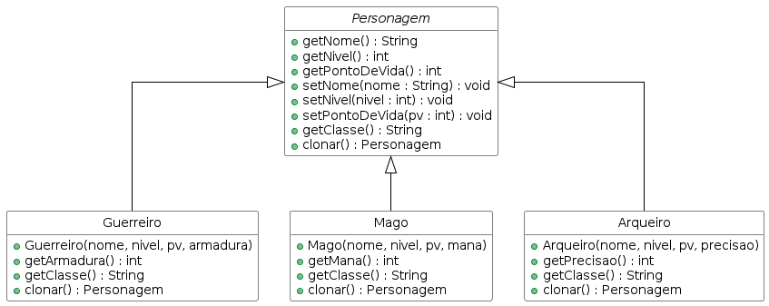

# Fichas de Personagem em RPG

Sistema que permite criar novos personagens a partir de um modelo já configurado, sem precisar preencher tudo do zero.

## Domínio

Um RPG tem três classes de personagem: Guerreiro, Mago e Arqueiro. Cada um tem atributos próprios (armadura, mana, precisão) além dos comuns (nome, nível, pontos de vida). Clonar uma ficha gera um personagem independente — modificar o clone não altera o original.

## Padrão aplicado

**Prototype** — a classe abstrata `Personagem` define o contrato `clonar()`. Cada subclasse implementa sua própria cópia, retornando uma instância nova com os mesmos atributos. O cliente não precisa conhecer a classe concreta para duplicar um personagem.

## Diagrama de classes

